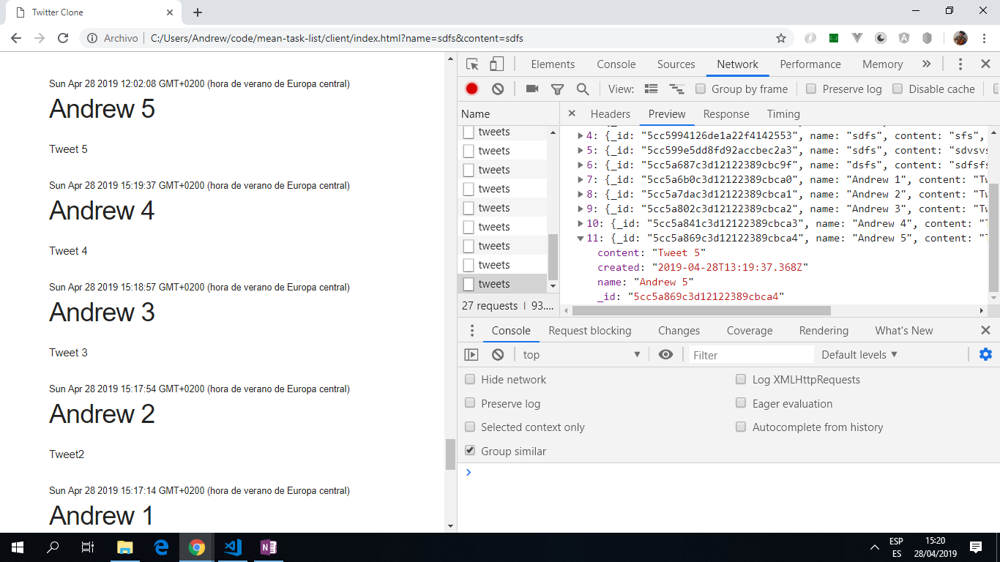

# MEAN Task List

* Simple full-stack app that displays a list of messages ('tweets') generated on the client side and processes them using backend node.js. Future link to mongodb database to save messages.

*** Note: to open web links in a new window use: _ctrl+click on link_**

## Table of contents

* [General info](#general-info)
* [Screenshots](#screenshots)
* [Technologies](#technologies)
* [Setup](#setup)
* [Features](#features)
* [Status](#status)
* [Inspiration](#inspiration)
* [Contact](#contact)

## General info

* A simplified Twitter clone.

## Screenshots

.

## Technologies

* [Node.js v10.15.3](https://nodejs.org/en/)

* [npm javascript filter used on title and content user inputs](https://www.npmjs.com/package/bad-words)

* [npm Express rate limiting](https://www.npmjs.com/package/express-rate-limit) using Node internal store (i.e.not an external database).

* [npm monk toolkit for mongodb](https://nodejs.org/en/)

## Setup

Run `npm run dev` for a dev server. Navigate to `http://localhost:5000/`. The app uses Nodemon and will automatically reload if you change any of the source files.

## Code Examples

* `server/index.js` - function to post tweet data from html frontend req.body parameters; filtering text then adding to tweets array.

```javascript

app.post('/tweets', (req, res, next) => {
	if(isValidTweet(req.body)) {
		const tweet = {
			name: filter.clean(req.body.name.toString()),
			content: filter.clean(req.body.content.toString()),
			created: new Date()
		};

		tweets
			.prepend(tweet)
			.then(createdTweet => {
				res.json(createdTweet);
			});

	} else {
		res.status(422);
		res.json({
			message: 'Helooo, name and message are required'
		});
	}
});

```

## Features

* A simple app with vanilla javascript. No js framework used.

## Status & To-Do List

* Status: basic working app that saves tweets locally.

* To-Do: Correct code so latest tweet listed first (`reverse()` function not working). Remove duplication of tweets. Add connection to mongodb database.

## Inspiration

* [Tutorial: The Coding Train: Build a Full Stack Twitter Clone with Coding Garden](https://www.youtube.com/watch?v=JnEH9tYLxLk)

## Contact

Created by [ABateman](https://www.andrewbateman.org) - feel free to contact me!
